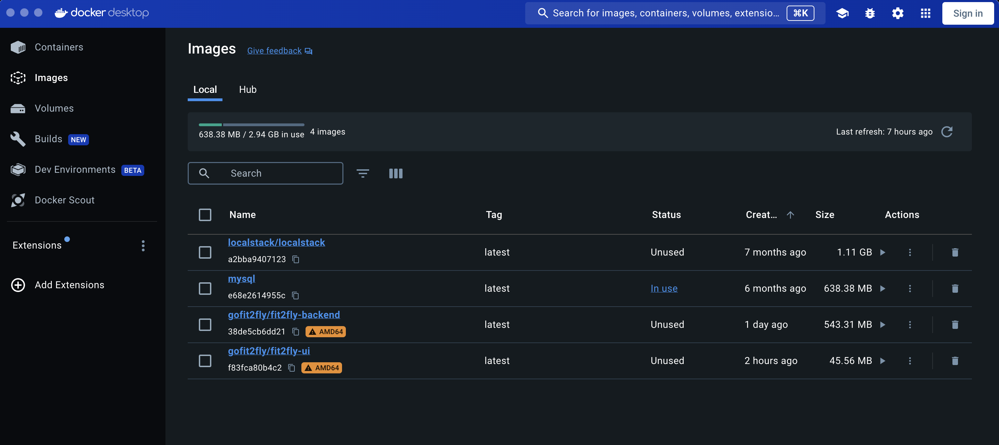
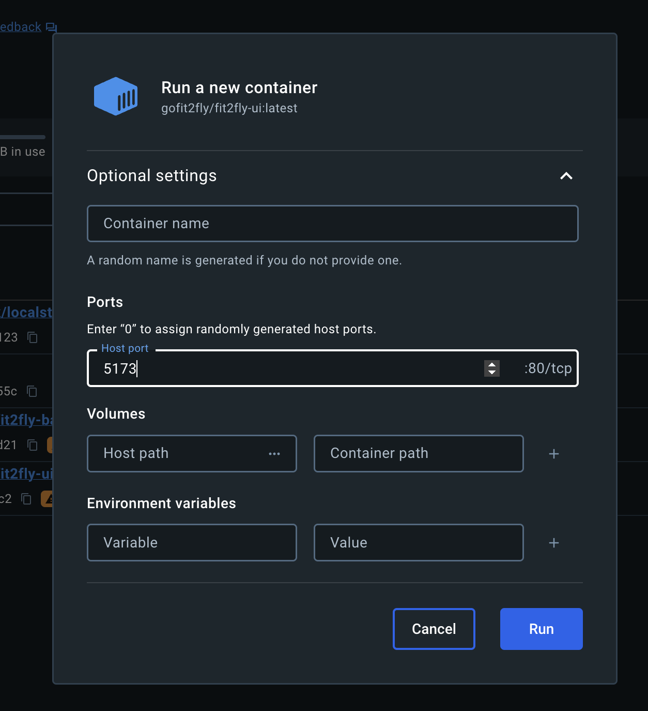
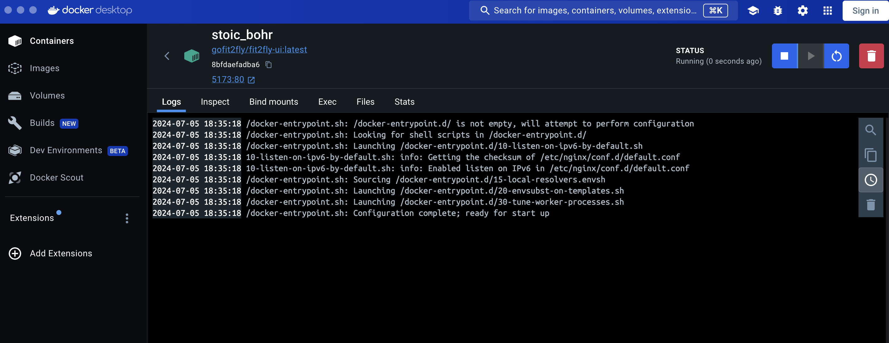

## Run server like staging or prod locally

- Install docker desktop from https://www.docker.com/products/docker-desktop/ and run locally
- Then from project root, run the below commands in sequence
  - npm install
  - npm run build-staging
  - docker build --platform linux/amd64 --tag=gofit2fly/fit2fly-ui --force-rm=true .
- It may take sometime, but it will upload the image on docker like below
  
- You may stop, remove old containers running this image from Containers section
- Click on run next to the image
- Enter host port as 5173
- Enter environment variables if any
- Click Run
  
- It will start a new container on 5173:80
- 
